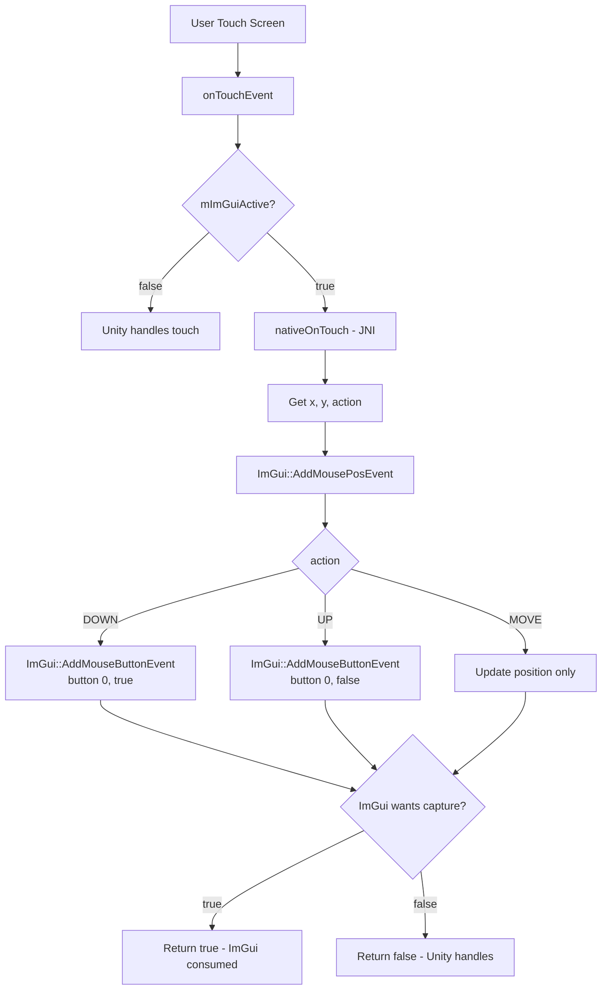

```mermaid
flowchart TD
    A[User Touch Screen] --> B[onTouchEvent]
    B --> C{mImGuiActive?}
    
    C -->|false| D[Unity handles touch]
    C -->|true| E[nativeOnTouch - JNI]
    
    E --> F[Get x, y, action]
    F --> G[ImGui::AddMousePosEvent]
    G --> H{action}
    
    H -->|DOWN| I[ImGui::AddMouseButtonEvent<br/>button 0, true]
    H -->|UP| J[ImGui::AddMouseButtonEvent<br/>button 0, false]
    H -->|MOVE| K[Update position only]
    
    I --> L{ImGui wants capture?}
    J --> L
    K --> L
    
    L -->|true| M[Return true - ImGui consumed]
    L -->|false| N[Return false - Unity handles]
```